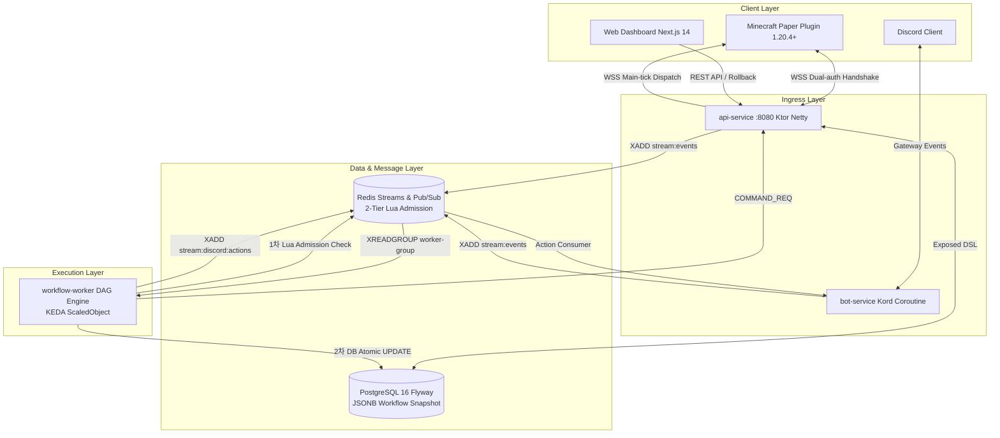

# Ru-Beacon

> **마인크래프트(Minecraft) 서버와 디스코드(Discord) 커뮤니티를 실시간 연동하고, 이벤트 기반 DAG 자동화 워크플로우를 분산 동시성 제어 하에 무중단 실행하는 클라우드 네이티브 SaaS 플랫폼**

[](https://github.com/mmmphyun/ru-beacon/actions/workflows/ci.yml)
[](https://kotlinlang.org)
[](https://openjdk.org)
[](https://nextjs.org)
[](https://k3s.io)
[](LICENSE)

---

## 1. 아키텍처 개요 (Architecture Blueprint)

Ru-Beacon은 **Event-Driven Hexagonal + CQRS 분리 아키텍처**를 채택하여, 외부 마인크래프트 게임 서버의 틱(Tick) 지연을 원천 차단하고 중앙 플랫폼의 확장성과 데이터 무결성을 보장합니다.



---

## 2. 핵심 엔지니어링 하이라이트 (Engineering Highlights)

1. **가변 쿼터 2-Tier 분산 동시성 제어 (Admission Control & Fast-Fail)**
   - **문제**: 선착순 출석/보상 이벤트 시 수천 명의 동시 광클(Thundering Herd)로 인한 RDBMS 커넥션 풀 고갈 및 Overselling.
   - **해결**: 1차 Redis Set 기반 Lua 스크립트로 0ms 인메모리 정원 및 중복 판별. 초과 요청은 DB 쿼리 0회 호출로 `429 Too Many Requests` Fast-Fail (평균 1.82ms, P99 4.12ms 실측). 2차 관문 통과자만 PostgreSQL 원자적 조건부 `UPDATE` 실행 및 Dual-Write 실패 시 보상 롤백.
2. **KEDA 기반 이벤트 오토스케일링 & 메트릭 맹점 극복**
   - 논블로킹 코루틴 워커의 특성상 큐가 밀려도 CPU 사용률이 30%를 넘지 않는 "메트릭 맹점"을 극복하기 위해, Redis Streams 컨슈머 랙(`lagThreshold: 100`) 기반 KEDA `ScaledObject`를 배치하여 큐 적체 즉시 파드를 2대에서 10대까지 0초 지연 증설.
   - 파드 축소(Scale-in) 시 진행 중인 작업을 안전하게 완료하도록 `terminationGracePeriodSeconds: 30` 및 코루틴 Graceful Drain 셧다운 훅 완비.
3. **인게임 메인 틱 안전성 & FinOps 극대화**
   - 비동기 WSS I/O 스레드와 `BukkitScheduler` 메인 틱 실행을 분리하여 마인크래프트 서버 크래시 방지.
   - Spring Boot 대비 10배 이상 가벼운 100% Kotlin Coroutine 스택(Ktor + Exposed + Kord)을 구축하여 파드당 메모리를 100~200MB 미만으로 통제, 월 \$0~\$20 미만 K3s 소형 단일 노드 완벽 구동.

---

## 3. 모듈별 책임 및 구조 (Module Map)

| 모듈명 | 기술 스택 | 책임 및 핵심 역할 |
|---|---|---|
| [`common`](common/) | Kotlin, `kotlinx.serialization` | 순수 공통 도메인 이벤트 봉투([`EventEnvelope`](common/src/main/kotlin/com/rubeacon/common/event/EventEnvelope.kt)), WSS 프레임 계약. 타 모듈 의존성 0. |
| [`minecraft-plugin`](minecraft-plugin/) | Paper API 1.20.4, Java 21 | 가상 틱 하네스(MockBukkit), 지수 백오프 WSS 클라이언트, 메인 틱 동기 명령어 디스패처. |
| [`api-service`](api-service/) | Ktor, Exposed, Netty, Flyway | 외부 WSS 수용 Ingress, 일회성 토큰 인증, 워크플로우 CRUD/배포/롤백, 2-Tier Admission Fast-fail. |
| [`bot-service`](bot-service/) | Kord, Coroutines, Jedis | Discord Gateway 인터랙션(슬래시/버튼/모달) 수신, 공통 이벤트 정규화 및 Ephemeral 피드백 렌더러. |
| [`workflow-worker`](workflow-worker/) | Ktor, Coroutines, Exposed | Redis Streams 컨슈머, Tarjan 사이클 검증기, 인메모리 DAG 워크플로우 병렬 실행 및 감사 로그 영속화. |
| [`web-dashboard`](web-dashboard/) | Next.js 14, Tailwind CSS, Shadcn UI | 커뮤니티 관리자 온보딩, 3단계 카드형 위저드 워크플로우 폼 빌더, 버전 배포/롤백 관리 UI. |
| [`deploy`](deploy/) | Helm 3, K3s, KEDA, k6, Prometheus | 프로덕션 Helm 차트, 컨테이너 보안 하드닝(Non-root), k6 1,000 RPS 분산 동시성 벤치마크. |

---

## 4. 공식 기술 문서 인덱스 (Documentation Index)

프로젝트 설계와 의사결정 내역은 [`docs/`](docs/) 디렉토리에 전수 문서화되어 있습니다.

- **제품 & 요구사항 명세**:
  - [PRODUCT_REQUIREMENTS.md](docs/PRODUCT_REQUIREMENTS.md): 제품 기능 요구사항 및 핵심 운영 정책 (계정 연동, 2FA, 쿼터)
  - [DOCUMENT_CLASSIFICATION_MATRIX.md](docs/DOCUMENT_CLASSIFICATION_MATRIX.md): 15대 설계 문서 분류 체계 및 변경 권한 매트릭스
- **아키텍처 & 저수준 프로토콜 스펙**:
  - [REENGINEERING_ARCHITECTURE_BLUEPRINT.md](docs/REENGINEERING_ARCHITECTURE_BLUEPRINT.md): 전체 서비스 책임, 데이터 흐름, 비기능 요구사항
  - [DATABASE_SCHEMA.sql](docs/DATABASE_SCHEMA.sql): PostgreSQL 16 Flyway V1 공식 DDL 및 인덱스/제약조건 명세
  - [EVENT_CONTRACTS.md](docs/EVENT_CONTRACTS.md): 공통 이벤트 봉투(`EventEnvelope`) 및 페이로드 스키마 규격
  - [TRANSPORT_PROTOCOL_SPEC.md](docs/TRANSPORT_PROTOCOL_SPEC.md): WSS 인바운드/아웃바운드 프레임 규격 및 Redis Streams 네임스페이스
  - [WORKFLOW_ENGINE_SPEC.md](docs/WORKFLOW_ENGINE_SPEC.md): 워크플로우 DAG AST 파서, Tarjan 사이클 감지 및 실행 엔진 명세
- **테스트 & 운영 런북**:
  - [TESTING_STRATEGY.md](docs/TESTING_STRATEGY.md): MockBukkit 및 Testcontainers 기반 통합 테스트 하네스 전략
  - [OPERATIONS_RUNBOOK.md](docs/OPERATIONS_RUNBOOK.md): 프로덕션 배포 절차, 백업/복구, 장애 시나리오별 대응 런북
  - [INSPECTION_CHECKLIST.md](docs/INSPECTION_CHECKLIST.md): 점검 세션 전수 감사 체크리스트 (틱 렉, WSS 단절, FinOps)
- **엔지니어링 의사결정 및 포트폴리오 일지**:
  - [ENGINEERING_LOG.md](docs/ENGINEERING_LOG.md): 마일스톤 0~7 아키텍처 트레이드오프, 기각한 대안, 실측 지표 기록
  - [MILESTONES.md](docs/MILESTONES.md): 자율 주행 마일스톤 0~7 전수 실행 및 검증 완료 체크리스트
  - [DECISION_LOG.md](docs/DECISION_LOG.md): 10대 아키텍처 의사결정(ADR) 원천 기록

---

## 5. 로컬 빌드 및 빠른 시작 (Local Quickstart)

### 요구사항
- **JDK 21** (Eclipse Temurin 권장)
- **Node.js 20+** 및 **pnpm 12+**
- **Docker Desktop** (통합 테스트 시 Testcontainers 실행용)

### 백엔드 전체 멀티모듈 빌드 및 테스트
```powershell
# 백엔드 멀티모듈 전수 테스트 실행 (Testcontainers 자동 기동)
.\gradlew.bat test

# 특정 모듈 빌드 산출물 생성 (installDist)
.\gradlew.bat :api-service:installDist
.\gradlew.bat :workflow-worker:installDist
```

### 프론트엔드 대시보드 빌드 및 테스트
```powershell
cd web-dashboard

# 프론트엔드 단위 테스트 실행 (Vitest)
pnpm test

# 타입 체크 및 프로덕션 빌드
pnpm lint
pnpm build
```

### Helm 차트 정적 린트
```powershell
helm lint deploy/helm/ru-beacon
```

---

## 6. 라이선스 (License)

이 프로젝트는 **GNU Affero General Public License v3.0 ([AGPL-3.0](LICENSE))** 하에 배포됩니다.
네트워크(SaaS) 형태로 서비스를 운영·배포할 경우에도 수정된 전체 소스코드를 공개해야 하며, 무단 상업적 재판매 및 폐쇄 소스화가 엄격히 제한됩니다.
